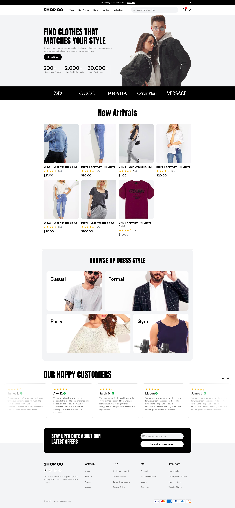
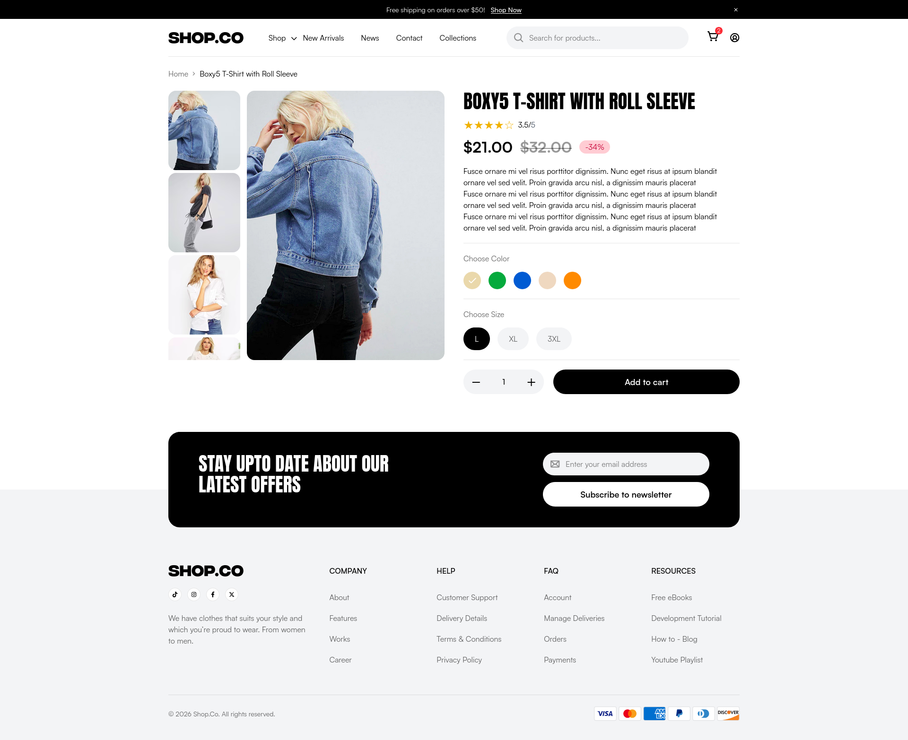
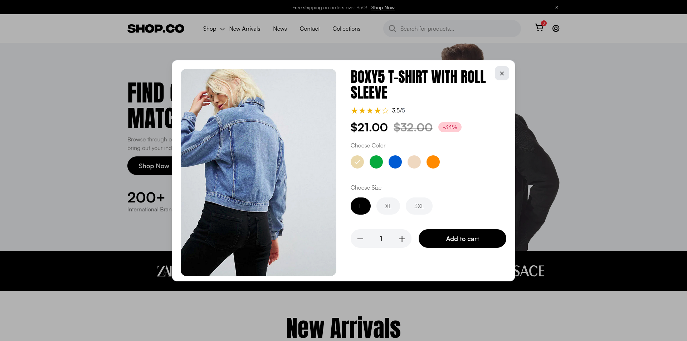
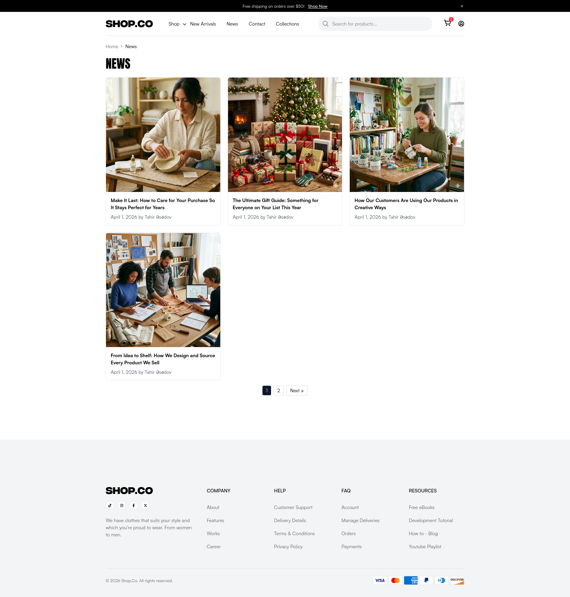
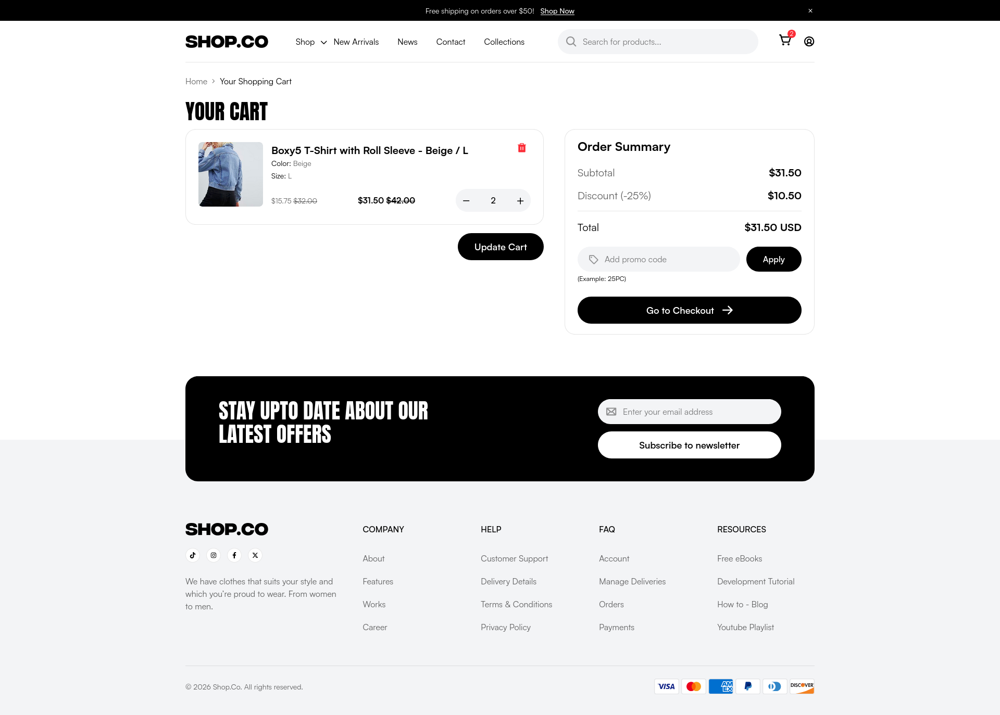

# 🛍️ Shop.Co Theme — Custom Storefront

A modern, handcrafted Shopify theme built on top of the **Shopify Skeleton Theme** — not Dawn, not Horizon. Designed pixel-by-pixel from a [free Figma e-commerce template](https://www.figma.com/design/OBbeagN9gAmzItHftHwaT0/E-commerce-Website-Template--Freebie---Community-?node-id=39-1402&p=f&t=tUyz1kO9oqZszkaV-0), and implemented with **Tailwind CSS v4**, **Vanilla JavaScript**, and native **Web Components**.

---

## 🔗 Live Preview

> **Store URL:** [https://shopcodemo.myshopify.com](https://shopcodemo.myshopify.com) **Store Password:** `tahir`

---

## ✨ Features

- 🧱 **Web Components** — UI elements are encapsulated as reusable, framework-agnostic native web components
- 🎨 **Tailwind CSS v4** — Utility-first styling with the latest Tailwind CSS release
- 📱 **Fully Responsive** — Mobile-first layout that adapts gracefully to all screen sizes
- ⚡ **Vanilla JavaScript** — No heavy frameworks; lean and fast by design
- 🏗️ **Shopify Skeleton Base** — Built on the minimal Shopify Skeleton Theme, not Dawn or Horizon
- 🎯 **Figma-to-Code** — Faithfully implemented from a community Figma design system

---

## 🛠️ Tech Stack

| Layer         | Technology                |
| ------------- | ------------------------- |
| Platform      | Shopify                   |
| Base Theme    | Shopify Skeleton Theme    |
| Styling       | Tailwind CSS v4           |
| Scripting     | Vanilla JavaScript        |
| Components    | Native Web Components     |
| Design Source | Figma (Community Freebie) |

---

## 📸 Screenshots

### 🏠 Home

### 🛍️ Product

### 🔍 Product Dialog

### 📝 Blog

### 💳 Cart

---

## 📐 Design Reference

This theme is based on the following free Figma community file:

**[E-commerce Website Template — Freebie (Community)](https://www.figma.com/design/OBbeagN9gAmzItHftHwaT0/E-commerce-Website-Template--Freebie---Community-?node-id=39-1402&p=f&t=tUyz1kO9oqZszkaV-0)**

---

## 📄 License

This project is open source and available under the [MIT License](LICENSE).

---

## 🙏 Acknowledgements

- [Shopify Skeleton Theme](https://github.com/Shopify/skeleton-theme) — minimal base theme
- [Tailwind CSS](https://tailwindcss.com/) — utility-first CSS framework
- [Figma Community Template](https://www.figma.com/design/OBbeagN9gAmzItHftHwaT0/E-commerce-Website-Template--Freebie---Community-?node-id=39-1402&p=f&t=tUyz1kO9oqZszkaV-0) — original UI design
